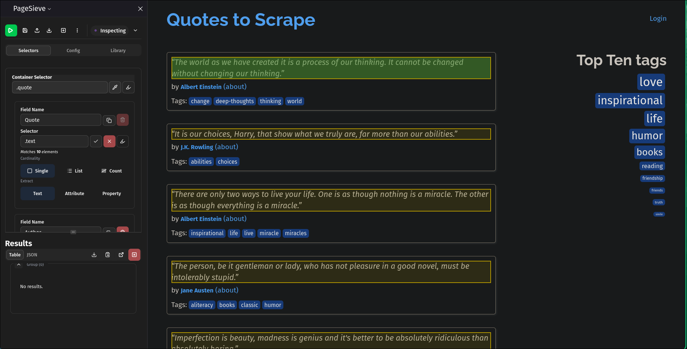
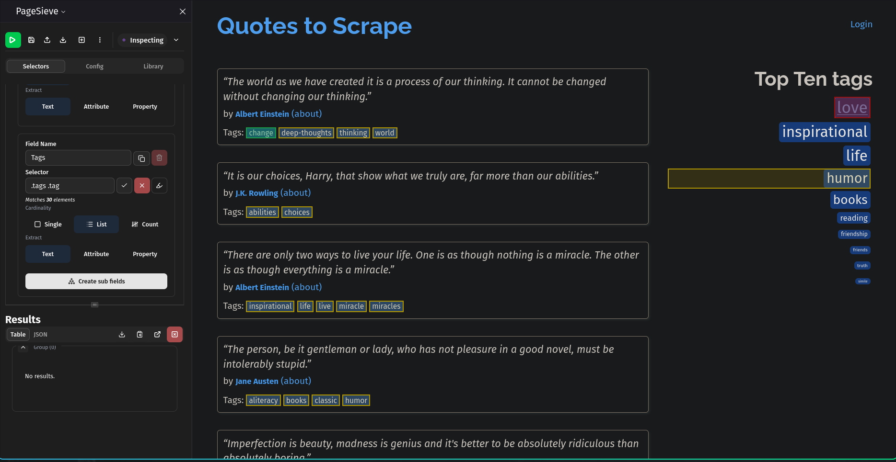

PageSieve allows you to define fields using CSS selectors, XPath expressions, or interactive point-and-click selection. This guide explains the selection syntax, scoping rules, and extraction targets.

## Point-and-Click Selection

The browser extension embeds an interactive DOM inspector adapted from [SelectorGadget](https://github.com/cantino/selectorgadget/).

1. Click **Pick** next to any field in the sidebar.
2. Click an element on the webpage you wish to target (highlighted in yellow/green).
3. If unneeded elements are highlighted, click them to reject them (highlighted in red).
4. The algorithm automatically calculates an optimal CSS selector matching your desired elements.

::: {layout-ncol=2}
{.lightbox}

{.lightbox}
:::

## Scoping with Containers

When extracting repeated items (e.g. products, rows, cards), use the `container` field on a [SelectorGroup](configuration.qmd#selectorgroup) (_Container Selector_ input field in Extension Sidebar UI):

```json
{
  "name": "Quote Items",
  "container": ".quote",
  "fields": [
    {
      "name": "Quote Text",
      "selector": ".text",
      "type": "single",
      "extract": "text"
    }
  ]
}
```

- **With** `container`: Each field's `selector` is evaluated relative to each container element.
- **Without** `container`: Selectors are evaluated against the entire document once (page-level extraction).


::: {.callout-note}
### Treating Entire Page as Container
To extract singular individual fields from a page _always_ include a container even
one like `body` since by extractor assumes you're working with multiple
instances of each field on a page. This lets you extract data similar to the [Obsidian
Clipper](https://github.com/obsidianmd/obsidian-clipper/).
:::

## Special Selector Syntax

### The Dot (`.`) Selector

When targeting an attribute or property directly on the container element itself, use `.` as the field selector:

```json
{
  "id": "f_Z9Wpuf",
  "name": "URL",
  "selector": ".",
  "type": "single",
  "extract": "attribute",
  "attribute": "href",
  "required": false
}
```

This extracts the `href` attribute from the container element itself without querying for child nodes.

See the [Scraping Members of National Assembly from Mzalendo Example](../examples/scraping-mzalendo-members-of-national-assembly.qmd) for a demonstration.

### Relative XPath

When extracting elements that require navigating up the DOM tree or selecting preceding/following sibling nodes relative to a container, you can provide an XPath expression:

```json
{
  "id": "f_qn54EZ",
  "name": "Company Name",
  "selector": "../../../../preceding-sibling::tr[1]/td[2]/a/text()",
  "type": "single",
  "extract": "text",
  "required": false
}
```

See the [Fortune 500 Companies Example](../examples/scraping-fortune-500-companies.qmd) for a practical 
demonstration. This pattern is useful when you want to associate each 
container element with a single value. 

## Extraction Targets

The `extract` option determines what data is collected from the matched element:


| `extract` Value | Additional Requirement | Description                                                                     |
| --------------- | ---------------------- | ------------------------------------------------------------------------------- |
| `"text"`        | None                   | Extracts trimmed text content (`textContent`).                                  |
| `"attribute"`   | `attribute: "<name>"`  | Extracts an HTML attribute (e.g., `href`, `src`, `title`, `data-*`).            |
| `"property"`    | `property: "<name>"`   | Extracts DOM property: `innerHTML`, `outerHTML`, `innerText`, or `textContent`. |


## Multi-Value & Nested Fields

- **`type: "single"`**: Returns a single scalar value from the first matching element.
- **`type: "multiple"`**: Returns an array of values for all matching elements within the container.
- **`type: "count"`**: Returns the numeric count of matching elements.
- **Recursive Sub-Fields**: When `type` is set to `"multiple"`, you can specify nested `fields: [...]` to produce structured array-of-objects data within a row.
